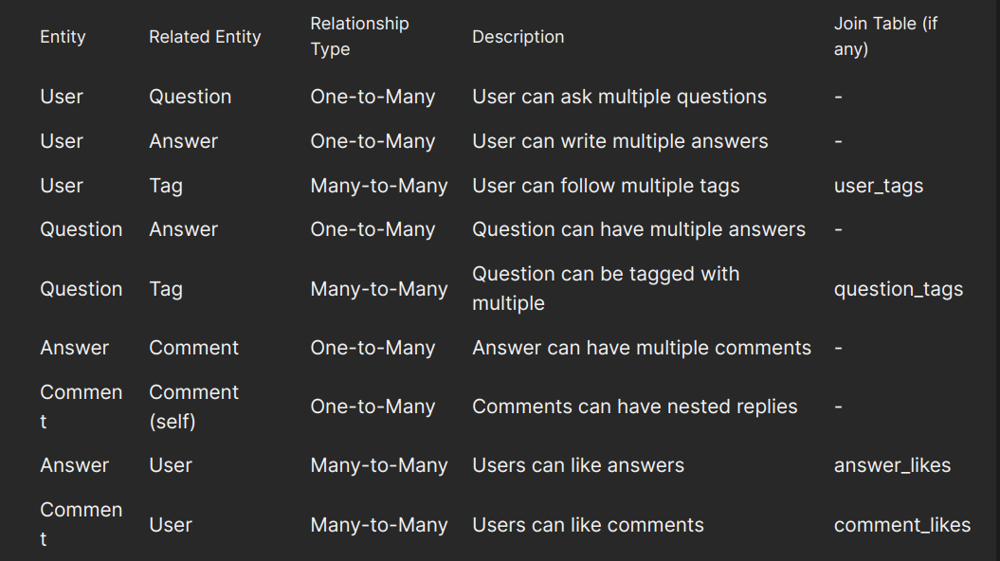
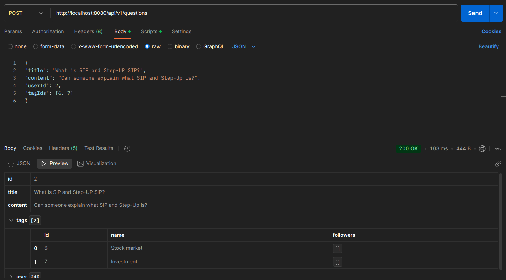
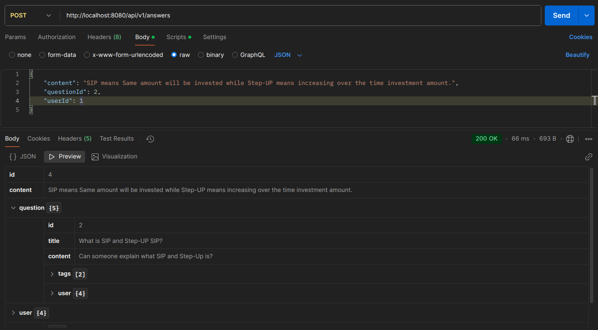
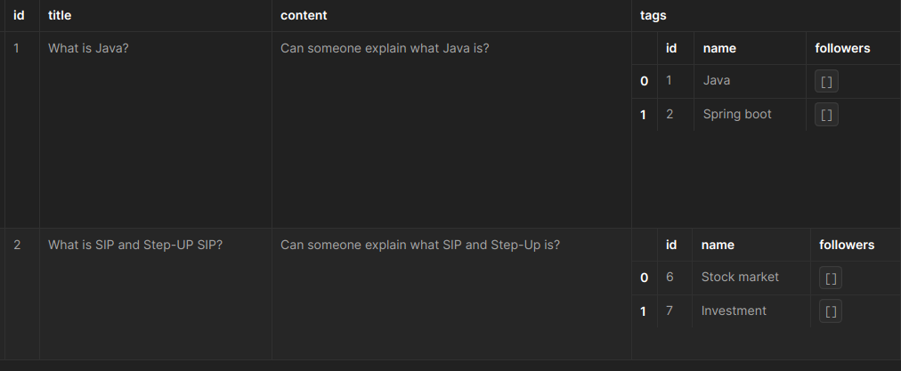

# Ask And Answer Hub Backend Q&A Platform

## Features

- **User Management**: Create/Delete users, follow tags
- **Questions**: Post questions with tags, browse questions
- **Answers**: Post answers to questions, view answers
- **Comments**: Add comments to answers with nested replies
- **Tags**: Create tags, follow tags, browse tag-specific questions
- **User Feed**: Personalized feed based on followed tags

## Entity Relationships Table:


## Create question:


## Answer to question:


## Questions structure in Easy way to understand



## API Test
#### 1. Create a User
```
curl -X POST -H "Content-Type: application/json" -d '{"username": "user1", "password": "password"}' http://localhost:8080/api/v1/users
```

#### 2. Create Tags
```
curl -X POST -H "Content-Type: application/json" -d '{"name": "Java"}' http://localhost:8080/api/v1/tags
curl -X POST -H "Content-Type: application/json" -d '{"name": "Spring Boot"}' http://localhost:8080/api/v1/tags
```

#### 3. Create a Question
```
curl -X POST -H "Content-Type: application/json" -d '{"title": "What is Java?", "content": "Can someone explain what Java is?", "userId": 1, "tagIds": [1, 2]}' http://localhost:8080/api/v1/questions
```

#### 4. Get All Questions with Pagination
```
curl -X GET "http://localhost:8080/api/v1/questions?page=0&size=10"
```

#### 5. Create an Answer
```
curl -X POST -H "Content-Type: application/json" -d '{"content": "Java is a programming language.", "questionId": 1, "userId": 1}' http://localhost:8080/api/v1/answers
```

#### 6. Get Answers for a Question with Pagination
```
curl -X GET "http://localhost:8080/api/v1/answers/question/1?page=0&size=10"
```

#### 7. Create a Comment on an Answer
```
curl -X POST -H "Content-Type: application/json" -d '{"content": "Thanks for the explanation.", "answerId": 1, "userId": 1}' http://localhost:8080/api/v1/comments
```

#### 8. Get Comments for an Answer with Pagination
```
curl -X GET "http://localhost:8080/api/v1/comments/answer/1?page=0&size=10"
```

#### 9. Create a Reply to a Comment
```
curl -X POST -H "Content-Type: application/json" -d '{"content": "You're welcome!", "answerId": 1, "parentCommentId": 1}' http://localhost:8080/api/v1/comments
```

#### 10. Get Replies for a Comment with Pagination
```
curl -X GET "http://localhost:8080/api/v1/comments/comment/1?page=0&size=10"
```
